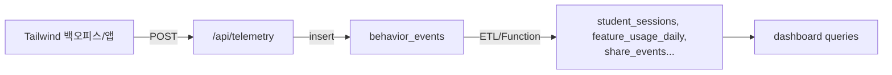

# Supabase 스키마 & 이벤트 정의

- 프로젝트: `https://xapdavccozcmqkszsnui.supabase.co`
- 목적: `docs/backoffice_prd.md`에서 정의한 지속성·stickiness·기능 고착도·자기 수정 등 핵심 지표를 계산할 수 있도록 표준 이벤트 스키마를 설계한다.
- 저장 방식: 모든 UI/서버 이벤트는 `behavior_events` 테이블로 수집하고, 지표별 파생 테이블(세션, 문제 풀이, 기능 사용, 공유, 리텐션)을 유지한다.

## 1. 핵심 테이블

### 1.0 access_codes / access_code_sessions (백오피스 접근)
```sql
create table if not exists public.access_codes (
  id uuid primary key default uuid_generate_v4(),
  code_name text not null unique,
  code_hash text not null,
  is_active boolean not null default true,
  created_at timestamptz not null default now(),
  updated_at timestamptz not null default now()
);

create table if not exists public.access_code_sessions (
  id uuid primary key default uuid_generate_v4(),
  code_id uuid not null references public.access_codes(id) on delete cascade,
  token text not null unique,
  expires_at timestamptz not null,
  revoked_at timestamptz,
  issued_at timestamptz not null default now()
);
```
- 접근 코드 해시(`code_hash`)는 `bcryptjs`로 암호화한다. 기본 접근 코드는 `Grammarpt2026!`이며 `supabase/schema.sql` 실행 시 자동으로 삽입된다.
- 로그인 성공 시 `access_code_sessions`에 12시간 동안 유효한 세션 토큰이 생성되고, Next.js API는 쿠키에 저장된 토큰을 검증한다.

### 1.1 behavior_events (원천 로그)
```sql
create table if not exists public.behavior_events (
  id uuid primary key default uuid_generate_v4(),
  event_type text not null,
  user_id uuid not null,
  session_id uuid,
  occurred_at timestamptz not null default now(),
  metadata jsonb not null default '{}'::jsonb,
  inserted_at timestamptz not null default now()
);
create index on public.behavior_events (event_type, occurred_at);
create index on public.behavior_events (user_id, occurred_at);
```
- `app/api/telemetry/route.js`가 삽입 담당. `metadata`에는 난이도, 기능 키, 공유 채널 등 지표 계산에 필요한 모든 필드를 JSON으로 담는다.

### 1.2 user_profiles (학생/가입 정보)
```sql
create table if not exists public.user_profiles (
  user_id uuid primary key,
  student_code text unique,
  grade int not null,
  school_type text,
  plan_type text,
  acquisition_channel text,
  joined_at timestamptz not null,
  cohort_week int generated always as (date_part('week', joined_at)) stored,
  created_at timestamptz not null default now(),
  updated_at timestamptz not null default now()
);
```
- 가입 주차, 학년별 cohort 분석 및 분해 필터에 활용.

### 1.3 student_sessions (세션 요약)
```sql
create table if not exists public.student_sessions (
  session_id uuid primary key,
  user_id uuid not null references public.user_profiles(user_id),
  started_at timestamptz not null,
  completed_at timestamptz,
  device text,
  entry_point text check (entry_point in ('notification','teacher','self')),
  easy_problem_count int default 0,
  hard_problem_count int default 0,
  easy_to_hard bool default false,
  dau_bucket date generated always as (date_trunc('day', started_at)) stored
);
create index on public.student_sessions (user_id, started_at);
create index on public.student_sessions (easy_to_hard);
```
- 지속성, 자발적 재사용, 노력 상승률 계산의 기본 팩트 테이블.

### 1.4 session_problem_attempts (문항 상세)
```sql
create table if not exists public.session_problem_attempts (
  id uuid primary key default uuid_generate_v4(),
  session_id uuid not null references public.student_sessions(session_id),
  user_id uuid not null references public.user_profiles(user_id),
  problem_id text not null,
  skill_id text,
  difficulty text,
  first_answer text,
  final_answer text,
  changed_before_submit bool default false,
  first_wrong_at timestamptz,
  corrected_at timestamptz,
  correction_latency_seconds int generated always as (
    extract(epoch from (coalesce(corrected_at, first_wrong_at) - first_wrong_at))
  ) stored
);
create index on public.session_problem_attempts (skill_id, difficulty);
create index on public.session_problem_attempts (changed_before_submit);
```
- 자기 수정률과 수정까지 걸린 시간 산출.

### 1.5 feature_usage_daily
```sql
create table if not exists public.feature_usage_daily (
  usage_date date not null,
  user_id uuid not null,
  feature_key text not null,
  session_id uuid,
  skill_id text,
  used_at timestamptz not null default now(),
  primary key (usage_date, user_id, feature_key)
);
create index on public.feature_usage_daily (feature_key, usage_date);
```
- 기능 고착도 계산 시 분모(Daily Active Users) 대비 특정 기능 사용률.

### 1.6 share_events
```sql
create table if not exists public.share_events (
  id uuid primary key default uuid_generate_v4(),
  user_id uuid not null,
  session_id uuid,
  channel text,
  recipient_type text check (recipient_type in ('parent','teacher','friend')),
  triggered_by text default 'self',
  shared_at timestamptz not null default now()
);
create index on public.share_events (channel, shared_at);
```
- 교사/부모 공유율 계산.

### 1.7 retention_cohort_snapshots
```sql
create table if not exists public.retention_cohort_snapshots (
  cohort_week int not null,
  grade int not null,
  week_offset int not null check (week_offset in (0,1,2,3,4,5,6,7,8)),
  active_users int not null,
  retained_users int not null,
  snapshot_date date not null default current_date,
  primary key (cohort_week, grade, week_offset)
);
```
- 4주차/8주차 유지율 표를 위한 주간 집계.

### 1.8 daily_kpi_snapshots
```sql
create table if not exists public.daily_kpi_snapshots (
  snapshot_date date primary key,
  dau int,
  wau int,
  mau int,
  dau_wau_ratio numeric,
  wau_mau_ratio numeric,
  stickiness_threshold numeric,
  created_at timestamptz default now()
);
```
- 대시보드 상단 KPI 카드 캐시.

## 2. 집계 뷰
- `admin_session_persistence_view`: 주차별 연속 4회 이상 세션 이용자/비율.
- `admin_voluntary_reuse_view`: 주차별 자발적 세션 비중.
- `admin_effort_uplift_view`: easy→hard 전환 사용자 비중.
- `admin_feature_stickiness_view`: 날짜·기능별 기능 고착도(기능 DAU / 전체 DAU).
- `admin_share_rate_view`: 주차별 교사/부모 공유율.
- `admin_self_correction_view`: 스킬별 자기 수정률 및 중간 수정 시간.
- 모든 뷰 정의는 `supabase/schema.sql` 하단에 포함되어 있으며, 백오피스 API(`app/api/admin/metrics`)가 직접 조회한다.

## 3. 이벤트 → 테이블 매핑
| PRD 지표 | 이벤트/테이블 | metadata 필드 예시 |
| --- | --- | --- |
| 연속 4회 세션 완료·지속성 | `student_sessions`, `behavior_events.session_complete` | `{ "week": 32 }` |
| DAU/WAU/MAU Stickiness | `behavior_events.session_start`, `daily_kpi_snapshots` | `{ "device":"mobile" }` |
| 자발적 재사용 | `student_sessions.entry_point='self'` | `metadata.entryPoint` |
| 노력 상승률 | `behavior_events.difficulty_progression`, `student_sessions.easy_to_hard` | `{ "from":"easy","to":"hard","skill_id":"SK123" }` |
| 기능 고착도 | `feature_usage_daily` | `{ "feature":"error_note" }` |
| 공유율 | `share_events` | `{ "channel":"kakao","recipient_type":"parent" }` |
| 유지율 코호트 | `retention_cohort_snapshots` | `{ "cohort_week":28,"grade":4 }` |
| 자기 수정률 | `session_problem_attempts.changed_before_submit` | `{ "skill_id":"SK1" }` |
| 수정까지 걸린 시간 | `session_problem_attempts.correction_latency_seconds` | `{}` |

## 4. Next.js → Supabase Telemetry 흐름
1. 클라이언트/서버에서 이벤트 발생 시 `fetch("/api/telemetry",{ method:"POST", body: JSON.stringify({...}) })`.
2. API route가 `behavior_events`에 저장.
3. DB 내 scheduled function이 이벤트를 해당 팩트 테이블로 upsert.
4. 뷰/머티리얼라이즈드 뷰로 최종 대시보드용 집계(`daily_kpi_snapshots`, `retention_cohort_snapshots`) 생성.



## 5. 샘플 쿼리
```sql
-- 주간 stickiness
select
  date_trunc('week', snapshot_date) as week,
  avg(dau_wau_ratio) as dau_wau,
  avg(wau_mau_ratio) as wau_mau
from daily_kpi_snapshots
group by 1
order by 1 desc;

-- 자발적 재사용
select
  date_trunc('week', started_at) as week,
  count(*) filter (where entry_point = 'self')::numeric / count(*) as voluntary_ratio
from student_sessions
group by 1
order by 1 desc;

-- 자기 수정률(스킬별)
select
  skill_id,
  sum(case when changed_before_submit then 1 else 0 end)::numeric / count(*) as self_correction_rate,
  percentile_disc(0.5) within group (order by correction_latency_seconds) as median_latency
from session_problem_attempts
group by skill_id;
```

## 6. 보안 & RLS
- 서비스 로직은 SSO 관리자 전용이므로, `behavior_events`/`student_sessions` 등에서 기본적으로 RLS 비활성화 + 서비스 키만 접근.
- 만약 클라이언트 직접 접근이 필요하면 `anon` 키로 사용 가능한 뷰만 허용하고 PII는 마스킹.

## 7. 다음 단계
1. Supabase SQL editor 또는 CLI로 `supabase/schema.sql` 내용을 실행.
2. 배치 함수(Edge Function/cron)에서 `behavior_events`를 팩트 테이블로 분류하는 프로시저 작성.
3. 백오피스 차트 컴포넌트에서 위 뷰를 호출하는 API route 구현.
